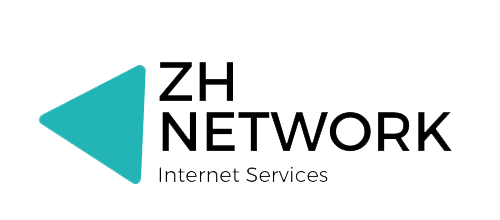

# ZHNETWORK BIRD CONFIG

  
## ZH NET (AS202888) BGP Communities [FOR PUBLIC SERVICE]
#### Community list for ZHNET customers
6939  = Hurricane Electric  
3257  = GTT  
40676 = PSYCHZ.NET  
58057 = Securebit.ch  
#### ZHNET-LAX (PSYCHZ.NET UPSTREAM)  
<strong>No advertise communities</strong>  
666:x where is the ASN of the peer your route will not be advertised to at all   

## ZH NET (AS202888) BGP Communities [FOR INTERAL SERVICE]  
  
#### BGP Pref
upstream: bgp_local_pref = 300;  
peer: bgp_local_pref = 500;  
downstream: upstream: bgp_local_pref = 900;  
  
#### 202888, 1 ZHNET-LAX (PSYCHZ.NET UPSTREAM)  
202888, 1, 65001 From Downstreams  
202888, 1, 65002 From Peers  
202888, 1, 65003 From Upstreams  
  
#### 202888, 2 ZHNET-LAX (-FMT UPSTREAM)  
202888, 2, 65001 From Downstreams  
202888, 2, 65002 From Peers  
202888, 2, 65003 From Upstreams  

#### 202888, 3 ZHNET-DE (DE-FRA UPSTREAM)  
202888, 3, 65001 From Downstreams  
202888, 3, 65002 From Peers  
202888, 3, 65003 From Upstreams  
  
#### 202888, 4 ZHNET-HK (HongKong UPSTREAM) Pending - - -   
202888, 4, 65001 From Downstreams  
202888, 4, 65002 From Peers  
202888, 4, 65003 From Upstreams  
  
#### 202888, 5 ZHNET-SG (Singapore UPSTREAM) Pending - - -   
202888, 5, 65001 From Downstreams  
202888, 5, 65002 From Peers  
202888, 5, 65003 From Upstreams  
  
